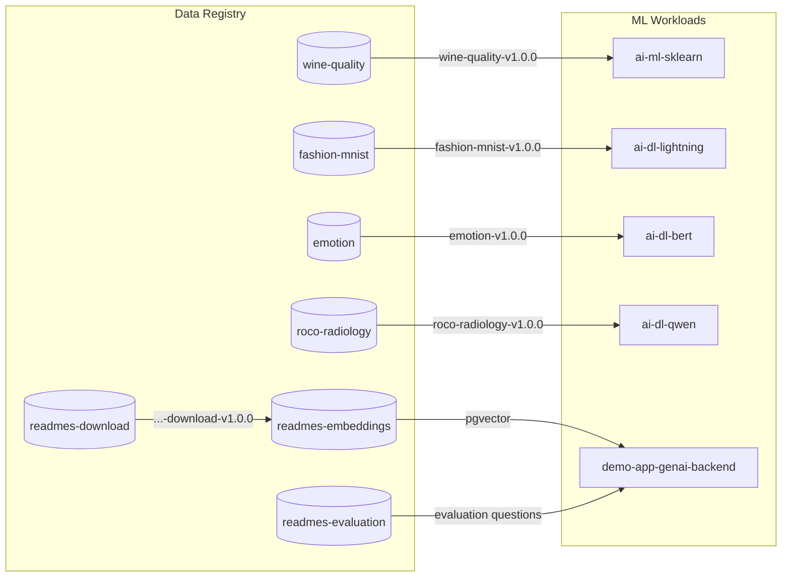
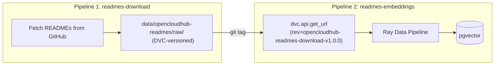

<a id="readme-top"></a>

<!-- PROJECT LOGO & TITLE -->

<div align="center">
  <a href="https://github.com/opencloudhub">
  <picture>
    <source media="(prefers-color-scheme: light)" srcset="https://raw.githubusercontent.com/opencloudhub/.github/main/assets/brand/assets/logos/primary-logo-light.svg">
    <source media="(prefers-color-scheme: dark)" srcset="https://raw.githubusercontent.com/opencloudhub/.github/main/assets/brand/assets/logos/primary-logo-dark.svg">
    <!-- Fallback -->
    
  </picture>
  </a>

<h1 align="center">Data Registry — Versioned Datasets for ML</h1>

<p align="center">
    Centralized data versioning with DVC, demonstrating reproducible ML data pipelines and metadata-driven training.<br />
    <a href="https://github.com/opencloudhub"><strong>Explore OpenCloudHub »</strong></a>
  </p>
</div>

______________________________________________________________________

<details>
  <summary>📑 Table of Contents</summary>
  <ol>
    <li><a href="#about">About</a></li>
    <li><a href="#thesis-context">Thesis Context</a></li>
    <li><a href="#architecture">Architecture</a></li>
    <li><a href="#pipelines">Pipelines</a></li>
    <li><a href="#code-structure">Code Structure</a></li>
    <li><a href="#getting-started">Getting Started</a></li>
    <li><a href="#infrastructure">Infrastructure Options</a></li>
    <li><a href="#usage">Usage</a></li>
    <li><a href="#configuration">Configuration</a></li>
    <li><a href="#design-decisions">Design Decisions</a></li>
    <li><a href="#contributing">Contributing</a></li>
    <li><a href="#license">License</a></li>
  </ol>
</details>

______________________________________________________________________

<h2 id="about">🎯 About</h2>

This repository manages **dataset preparation, versioning, and distribution** for ML training pipelines. It demonstrates how to build reproducible data pipelines using [DVC](https://dvc.org/) (Data Version Control) as part of a complete MLOps platform.

### The Problem DVC Solves

> *"What exact samples were in the training data for model v2.3 that we deployed two weeks ago?"*

In ML, **data is as important as code** — but traditional version control doesn't handle large files or binary data well:

- Raw data changes over time (new samples, corrections, augmentations)
- Training results become unreproducible without knowing exact data state
- No way to rollback to a known-good dataset state
- Large files (images, embeddings) don't belong in Git

**DVC creates git-like versioning for data:**

```bash
# Data versions are tied to git tags
git tag fashion-mnist-v1.0.0   # Points to specific dvc.lock
git tag fashion-mnist-v1.1.0   # New data version after processing changes

# Training code references exact version
dvc get https://github.com/OpenCloudHub/data-registry \
    data/fashion-mnist/processed \
    --rev fashion-mnist-v1.0.0
```

### Available Datasets

Each dataset is prepared for a specific ML workload in the platform:

| Dataset                           | Tag Format                            | Training Repo                                                                    | Use Case                         |
| --------------------------------- | ------------------------------------- | -------------------------------------------------------------------------------- | -------------------------------- |
| `wine-quality`                    | `wine-quality-v1.0.0`                 | [ai-ml-sklearn](https://github.com/opencloudhub/ai-ml-sklearn)                   | Baseline tabular regression      |
| `fashion-mnist`                   | `fashion-mnist-v1.0.0`                | [ai-dl-lightning](https://github.com/opencloudhub/ai-dl-lightning)               | Distributed image classification |
| `emotion`                         | `emotion-v1.0.0`                      | [ai-dl-bert](https://github.com/opencloudhub/ai-dl-bert)                         | Text classification with HPO     |
| `roco-radiology`                  | `roco-radiology-v1.0.0`               | [ai-dl-qwen](https://github.com/opencloudhub/ai-dl-qwen)                         | VLM fine-tuning                  |
| `opencloudhub-readmes-download`   | `opencloudhub-readmes-download-v1.0.0`| *(intermediate)*                                                                 | Source data for embeddings       |
| `opencloudhub-readmes-evaluation` | `opencloudhub-readmes-evaluation-v1.0.0` | [demo-app-genai-backend](https://github.com/opencloudhub/demo-app-genai-backend) | RAG evaluation test questions |
| `opencloudhub-readmes-embeddings` | `opencloudhub-readmes-embeddings-v1.0.0` | [demo-app-genai-backend](https://github.com/opencloudhub/demo-app-genai-backend) | RAG semantic search              |

**Notes:**
- The embeddings pipeline depends on the readmes-download pipeline, creating a two-stage lineage chain.
- The rag-evaluation dataset is a manually curated CSV (not from a pipeline) — see [Adding Data Manually](#adding-data-manually).

______________________________________________________________________

<h2 id="thesis-context">📚 Thesis Context</h2>

This repository is part of a Master's thesis: **"A Scalable MLOps System for Multimodal Educational Analysis"** at Goethe University Frankfurt / DIPF Leibniz Institute.

### Role in the Platform

The Data Registry sits at Layer 2 of the platform architecture — **between infrastructure and ML workloads**. All training jobs consume versioned data from this central registry, ensuring reproducibility across the entire ML lifecycle.

```
┌─────────────────────────────────────────────────────────────────────────────┐
│  Layer 1: INFRASTRUCTURE                                                    │
│    └─ Kubernetes, MinIO, PostgreSQL, MLflow, Ray, Argo                      │
├─────────────────────────────────────────────────────────────────────────────┤
│  Layer 2: DATA MANAGEMENT  ◄── THIS REPOSITORY                              │
│    └─ DVC pipelines, versioned datasets, embeddings generation              │
├─────────────────────────────────────────────────────────────────────────────┤
│  Layer 3: ML WORKLOADS                                                      │
│    └─ ai-ml-sklearn, ai-dl-lightning, ai-dl-bert, ai-dl-qwen                │
│    └─ All consume data via: dvc.api.get_url(rev="dataset-v1.0.0")           │
└─────────────────────────────────────────────────────────────────────────────┘
```

### Requirements Addressed

| Req ID   | Requirement          | Implementation                                             |
| -------- | -------------------- | ---------------------------------------------------------- |
| **FR2**  | Data Versioning      | DVC with git tags for immutable dataset snapshots          |
| **FR12** | RAG Pipeline Support | Embeddings pipeline with Ray Data + pgvector               |
| **FR13** | Prompt Versioning    | ROCO pipeline fetches prompts from MLflow Prompt Registry  |
| **NFR1** | End-to-End Lineage   | metadata.json tracks source, processing params, statistics |
| **NFR2** | Reproducibility      | Git tag → dvc.lock → exact data snapshot                   |
| **C1**   | Open-Source Only     | DVC, Ray Data, sentence-transformers — permissive licenses |
| **C2**   | Self-Hostable        | MinIO as S3-compatible storage backend                     |

### Key Patterns Demonstrated

| Pattern                      | Implementation                               | Why It Matters                                    |
| ---------------------------- | -------------------------------------------- | ------------------------------------------------- |
| **Git Tags = Data Versions** | `fashion-mnist-v1.0.0` → specific `dvc.lock` | Immutable snapshots for reproducibility           |
| **Metadata as Contract**     | `metadata.json` with normalization params    | Training and serving use same preprocessing       |
| **Three-Stage Pipelines**    | download → process → analyze                 | Separation of concerns, caching, reusability      |
| **Distributed Processing**   | Ray Data for embeddings pipeline             | Scale-out for compute-intensive pipelines         |
| **Prompt Lineage**           | ROCO fetches prompt from MLflow Registry     | Tracks which prompt was embedded in training data |

### Integration with ML Workloads



______________________________________________________________________

<h2 id="architecture">🏗️ Architecture</h2>

### DVC Version Control Model


**Key insight:** `dvc.lock` contains MD5 hashes of all data files. When you checkout a git tag, you get the exact `dvc.lock` from that point in time — which points to the exact data files in MinIO.

### Three-Stage Pipeline Pattern

Every dataset follows the same pipeline structure:


**Why this structure:**

- **Download** — Fetches from external source, cached to avoid repeated downloads
- **Process** — Transforms to ML-ready format, can be re-run if processing logic changes
- **Analyze** — Computes statistics (mean, std, class distribution) needed for training

### Metadata Flow to Training


This pattern ensures **training-serving consistency**: the serving endpoint uses the same normalization parameters that were computed during data processing.

### Production Execution via Argo Workflows


______________________________________________________________________

<h2 id="pipelines">📊 Pipelines</h2>

### Pipeline Overview

Each pipeline lives in `pipelines/<dataset>/` and consists of:

- `dvc.yaml` — Pipeline stage definitions
- `params.yaml` — Configuration parameters
- `scripts/` — Python scripts for each stage

### wine-quality (Baseline Tabular)

**Purpose:** Demonstrates simplest DVC pipeline with tabular data.

```yaml
# pipelines/wine-quality/dvc.yaml
stages:
  download:
    cmd: python scripts/download.py
    params: [download]
    outs: [../../data/wine-quality/raw]

  process:
    cmd: python scripts/process.py
    deps: [../../data/wine-quality/raw]
    params: [process]
    outs: [../../data/wine-quality/processed]

  analyze:
    cmd: python scripts/analyze.py
    deps: [../../data/wine-quality/processed]
    metrics: [../../data/wine-quality/metadata.json]
```

**Metadata output:** Feature statistics (mean, std, min, max) for normalization.

### fashion-mnist (Distributed Training)

**Purpose:** Image data with normalization parameters critical for training-serving consistency.

**Key metadata:**

```json
{
  "metrics": {
    "train": {
      "pixel_mean": 0.2860,
      "pixel_std": 0.3530,
      "num_samples": 60000
    }
  }
}
```

The training job fetches these values and:

1. Uses them for normalization during training
1. Logs them to MLflow as parameters
1. The serving endpoint loads them from DVC via the MLflow run's `dvc_data_version` tag

### emotion (HPO with Text)

**Purpose:** Text classification dataset for hyperparameter optimization demo.

**Key metadata:**

```json
{
  "label_map": {
    "0": "sadness",
    "1": "joy",
    "2": "love",
    "3": "anger",
    "4": "fear",
    "5": "surprise"
  }
}
```

The label mapping is logged as an MLflow artifact, ensuring the serving endpoint knows how to map model outputs to emotion names.

### roco-radiology (VLM with Prompt Versioning)

**Purpose:** Vision-Language Model fine-tuning with prompt lineage tracking.

**Key innovation:** The process stage fetches the prompt template from MLflow Prompt Registry:

```python
# pipelines/roco-radiology/scripts/process.py (conceptual)
prompt_info = mlflow.get_prompt(name="radiology-caption", version="1")

# Each processed sample includes the prompt
processed_sample = {
    "image": image_path,
    "conversations": [
        {"role": "user", "content": prompt_info.template + " {image}"},
        {"role": "assistant", "content": caption},
    ],
}
```

**Metadata tracks prompt lineage:**

```json
{
  "prompt": {
    "prompt_name": "radiology-caption",
    "prompt_version": 1,
    "prompt_template": "Describe this radiology image in detail..."
  }
}
```

### opencloudhub-readmes-embeddings (RAG Pipeline)

**Purpose:** Demonstrates Ray Data for batch embedding generation with full lineage tracking.

**Pipeline Dependency Chain:**

This pipeline depends on another pipeline, creating a two-stage lineage:



**Ray Data Processing Flow:**


**Why Ray Data here:**

The embeddings pipeline uses Ray Data not for distributed cluster execution, but to demonstrate the **batch processing pattern** that Ray enables:

- **Batch inference** — The embedder processes chunks in batches (e.g., batch_size=8) rather than one-by-one, significantly improving throughput
- **Streaming** — Reads from S3/MinIO without materializing all files in memory
- **Same framework** — Shows that Ray (used for training) can also handle data processing, reducing tool sprawl

This pattern could scale to distributed execution if needed — the code structure supports it — but in this demo it runs single-node to keep resource requirements manageable.

**Full Lineage in Vector Database:**

Every chunk stored in pgvector includes complete workflow metadata:

```python
{
    # Content metadata
    "source_repo": "opencloudhub/ai-ml-sklearn",
    "source_file": "README.md",
    "chunk_index": 3,
    "section_h1": "Getting Started",
    "section_h2": "Installation",
    # Data lineage (which version of source READMEs)
    "dvc_data_version": "opencloudhub-readmes-download-v1.0.0",
    # Processing lineage (which code/workflow produced this)
    "embedding_model": "all-MiniLM-L6-v2",
    "docker_image": "sha-abc123",
    "argo_workflow_uid": "workflow-xyz",
}
```

**Why this matters for evaluation:**

When comparing RAG prompt performance, you need to know which embeddings were used. The workflow tags enable queries like:

```sql
-- Compare retrieval quality across embedding versions
SELECT * FROM readme_embeddings
WHERE dvc_data_version = 'opencloudhub-readmes-download-v1.0.0'
  AND argo_workflow_uid = 'workflow-xyz';
```

This allows A/B testing different embedding models or chunk strategies while maintaining complete traceability.

______________________________________________________________________

<h2 id="code-structure">📂 Code Structure</h2>

### Project Layout

```
data-registry/
├── data/                              # Dataset storage (DVC-tracked)
│   ├── wine-quality/
│   │   ├── raw/                       # Downloaded CSV files
│   │   ├── processed/                 # Merged wine-quality.csv
│   │   └── metadata.json              # Statistics (Git-tracked)
│   ├── fashion-mnist/
│   │   ├── raw/                       # IDX files
│   │   ├── processed/train/           # Parquet with images + labels
│   │   ├── processed/val/             # Validation split
│   │   └── metadata.json              # pixel_mean, pixel_std
│   ├── emotion/
│   │   └── ...                        # Same structure
│   ├── roco-radiology/
│   │   ├── raw/images/                # X-ray images
│   │   ├── processed/train/           # Qwen conversation format
│   │   └── metadata.json              # Includes prompt_version
│   ├── opencloudhub-readmes-download/
│   │   └── raw/                       # README.md files from GitHub
│   ├── opencloudhub-readmes-evaluation/   # RAG test questions (manually curated)
│   │   ├── questions.csv              # Question, expected answer, key concepts
│   │   └── questions.csv.dvc          # DVC tracking file
│   └── opencloudhub-readmes-embeddings/
│       └── metadata.json              # Embedding pipeline stats
│
├── pipelines/                         # DVC pipeline definitions
│   ├── wine-quality/
│   │   ├── dvc.yaml                   # Pipeline stages
│   │   ├── params.yaml                # Configuration
│   │   └── scripts/
│   │       ├── download.py            # Fetch from GitHub mirror
│   │       ├── process.py             # Merge red/white wines
│   │       └── analyze.py             # Compute feature statistics
│   ├── fashion-mnist/                 # Same structure
│   ├── emotion/                       # Same structure
│   ├── roco-radiology/                # Same structure + prompt fetch
│   ├── opencloudhub-readmes-download/ # Fetch README files
│   │   ├── dvc.yaml
│   │   ├── params.yaml
│   │   └── scripts/download.py
│   └── opencloudhub-readmes-embeddings/
│       ├── dvc.yaml
│       ├── params.py                  # Python config (allows env overrides)
│       ├── run_pipeline.py            # Standalone runner
│       └── scripts/
│           ├── process.py             # Ray Data pipeline → pgvector
│           └── analyze.py             # Metadata generation
│
├── scripts/
│   ├── bootstrap-data-examples.sh     # Initialize all datasets for demo
│   └── reset-for-demo.sh              # Reset DVC state for fresh demo
│
├── .github/workflows/
│   ├── run-data-pipelines.yaml        # Trigger DVC pipelines via Argo
│   └── run-embeddings-pipeline.yaml   # Trigger Ray embeddings via Argo
│
├── .dvc/
│   └── config                         # DVC remote configuration (2 remotes)
├── .env.docker                        # Local docker compose environment
├── .env.minikube                      # Minikube/cluster environment
└── Dockerfile                         # Multi-stage: dev + prod
```

### DVC Pipeline Definition Pattern

```yaml
# pipelines/fashion-mnist/dvc.yaml
stages:
  download:
    cmd: python scripts/download.py
    deps:
      - scripts/download.py           # Re-run if script changes
    params:
      - download.base_url             # Re-run if config changes
    outs:
      - ../../data/fashion-mnist/raw  # DVC tracks these files

  process:
    cmd: python scripts/process.py
    deps:
      - scripts/process.py
      - ../../data/fashion-mnist/raw  # Depends on download output
    params:
      - process                       # All process.* params
    outs:
      - ../../data/fashion-mnist/processed/train
      - ../../data/fashion-mnist/processed/val

  analyze:
    cmd: python scripts/analyze.py
    deps:
      - scripts/analyze.py
      - ../../data/fashion-mnist/processed/train
      - ../../data/fashion-mnist/processed/val
    metrics:
      - ../../data/fashion-mnist/metadata.json:
          cache: false                # Keep in Git, not DVC
```

**Key DVC concepts:**

- **deps** — Files that trigger re-run when changed
- **params** — YAML parameters that trigger re-run when changed
- **outs** — Output files tracked by DVC (stored in MinIO)
- **metrics** — Output files tracked by Git (for easy viewing)

______________________________________________________________________

<h2 id="getting-started">🚀 Getting Started</h2>

### Prerequisites

- Docker
- VS Code with DevContainers extension (recommended)

### Setup

1. **Clone the repository**

   ```bash
   git clone https://github.com/opencloudhub/data-registry.git
   cd data-registry
   ```

1. **Open in DevContainer** (Recommended)

   VSCode: `Ctrl+Shift+P` → `Dev Containers: Rebuild and Reopen in Container`

1. **Choose infrastructure backend** (see next section)

______________________________________________________________________

<h2 id="infrastructure">🛠️ Infrastructure Options</h2>

> **⚠️ IMPORTANT: Understanding Multi-Environment DVC**
>
> DVC stores data in remote storage (MinIO) and references it via hashes in `dvc.lock`. The tricky part is that **the DVC remote URL is stored in the git repository's `.dvc/config`**, so when you `dvc get` or `dvc list` from the GitHub repo, it uses whatever remote is configured there — not your local environment.
>
> This creates challenges when working across environments:
>
> | Scenario | Problem | Solution |
> |----------|---------|----------|
> | Ran pipelines locally (docker), trying to list from GitHub | GitHub repo has minikube remote URL → connection timeout | Use `--remote docker` flag |
> | Ran pipelines in cluster, trying to list from devcontainer | Devcontainer can't reach internal cluster URLs | Port-forward or run from host |
> | Destroyed minikube, trying to get data | Data files are gone from that MinIO instance | Re-run pipelines or restore MinIO |
> | Mixed environments | Data pushed to one remote, tag created, can't access from other | Stick to one environment per workflow |
>
> **Golden Rule:** The environment where you `dvc push` must be accessible when you `dvc get/list/pull`.

### Option 1: Local Docker Compose (Recommended for Development)

Best for local development and testing. Uses [local-compose-stack](https://github.com/OpenCloudHub/local-compose-stack).

```bash
# 1. Start infrastructure
git clone https://github.com/OpenCloudHub/local-compose-stack.git
cd local-compose-stack && docker compose up -d

# 2. Configure environment
cd ../data-registry
set -a && source .env.docker && set +a

# 3. IMPORTANT: Unset CA bundle vars (they break boto/aiohttp when empty)
unset AWS_CA_BUNDLE CURL_CA_BUNDLE SSL_CERT_FILE

# 4. Run pipelines
./scripts/bootstrap-data-examples.sh --with-embeddings
```

**Services:**

| Service        | URL                   | Credentials     |
| -------------- | --------------------- | --------------- |
| MinIO Console  | http://localhost:9001 | admin/admin123  |
| MinIO API      | http://localhost:9000 | admin/admin123  |
| pgvector       | localhost:5433        | admin/admin     |
| MLflow UI      | http://localhost:5000 | -               |

**Using data pushed to docker remote:**

```bash
# From same machine with docker compose running:
dvc list https://github.com/OpenCloudHub/data-registry data/wine-quality --remote docker

# Or set environment and use API:
export AWS_ENDPOINT_URL=http://localhost:9000
export AWS_ACCESS_KEY_ID=admin
export AWS_SECRET_ACCESS_KEY=admin123
export DVC_REMOTE=docker
```

### Option 2: Minikube (Local Kubernetes)

For testing Kubernetes deployments locally. Requires MinIO deployed on minikube with ingress.

```bash
# 1. Ensure minikube services are running and accessible
#    (MinIO at minio-api.internal.opencloudhub.org)

# 2. Configure environment
set -a && source .env.minikube && set +a
unset AWS_CA_BUNDLE CURL_CA_BUNDLE SSL_CERT_FILE

# 3. Verify connectivity (from HOST, not devcontainer!)
curl -k https://minio-api.internal.opencloudhub.org/minio/health/live
```

**⚠️ Devcontainer Networking Issue:**

If you're in a VS Code devcontainer, the container likely **cannot reach** `minio-api.internal.opencloudhub.org` because:
- That DNS resolves to a local IP (e.g., 192.168.x.x) 
- The devcontainer has its own network namespace
- In this Devcontainer we run on the hosts network, but if restarting minikube, you lose context, but can just rebuild

**Workarounds:**

```bash
# Option A: Run DVC commands from HOST terminal (not devcontainer)
# Your host can resolve the minikube ingress

# Option B: Port-forward and use host.docker.internal
kubectl port-forward -n storage svc/minio-api 9000:9000
export AWS_ENDPOINT_URL=http://host.docker.internal:9000

# Option C: Add to devcontainer's /etc/hosts
echo "192.168.49.2 minio-api.internal.opencloudhub.org" >> /etc/hosts
```

### Option 3: Production (In-Cluster via Argo Workflows)

Pipelines run entirely on Kubernetes, triggered by GitHub Actions.

```bash
# Trigger via GitHub Actions UI or CLI:
gh workflow run run-data-pipelines.yaml \
  -f dataset=fashion-mnist \
  -f version=v1.0.0

# The workflow:
# 1. Submits Argo Workflow to cluster
# 2. Pipeline runs with cluster-internal MinIO URL
# 3. Creates git tag on success
```

**In-cluster DVC config:**

```ini
# .dvc/config (committed to repo)
[core]
    remote = minikube
['remote "minikube"']
    url = s3://dvcstore
    endpointurl = http://minio.minio-tenant.svc.cluster.local:80
```

The in-cluster URL (`minio.minio-tenant.svc.cluster.local`) is **only reachable from inside the cluster**. This is intentional for production, but means:

- ✅ Training jobs in cluster can access data
- ✅ GitHub Actions → Argo → DVC works
- ❌ Cannot `dvc list` from local machine without `--remote docker` or port-forward

### Environment Variables Reference

| Variable | `.env.docker` | `.env.minikube` | In-Cluster |
|----------|---------------|-----------------|------------|
| `AWS_ENDPOINT_URL` | `http://localhost:9000` | `https://minio-api.internal.opencloudhub.org` | (from ConfigMap) |
| `DVC_REMOTE` | `docker` | `minikube` | (not needed, uses config default) |
| `PGVECTOR_HOST` | `localhost` | `127.0.0.1` (port-forward) | (from Secret) |
| `PGVECTOR_PORT` | `5433` | `5432` | `5432` |

### Common Pitfalls

<details>
<summary><b>🔴 "Connect timeout" when listing/getting data</b></summary>

**Cause:** DVC is trying to reach a MinIO endpoint you can't access.

**Debug:**
```bash
# Check which endpoint DVC is trying to use:
dvc config core.remote  # Shows default remote
dvc config remote.minikube.endpointurl  # Shows URL

# Try with explicit remote:
dvc list https://github.com/OpenCloudHub/data-registry data/wine-quality --remote docker
```
</details>

<details>
<summary><b>🔴 "Unable to locate credentials" error</b></summary>

**Cause:** AWS_* environment variables not set or empty.

**Fix:**
```bash
set -a && source .env.docker && set +a
env | grep AWS  # Verify they're set
```
</details>

<details>
<summary><b>🔴 SSL/CA Bundle errors</b></summary>

**Cause:** Empty `AWS_CA_BUNDLE=""` is different from unset — it breaks boto/aiohttp.

**Fix:**
```bash
unset AWS_CA_BUNDLE CURL_CA_BUNDLE SSL_CERT_FILE REQUESTS_CA_BUNDLE
```
</details>

<details>
<summary><b>🔴 Data exists locally but can't list from GitHub</b></summary>

**Cause:** The git tag references a `dvc.lock` with hashes, but `dvc list` needs to fetch the `.dir` file from the remote to list directory contents.

**Scenario:**
1. You ran pipeline locally → data in local MinIO
2. Committed and tagged
3. Try `dvc list` from GitHub → tries minikube remote (from .dvc/config) → fails

**Fix:**
```bash
# Specify the correct remote explicitly:
dvc list https://github.com/OpenCloudHub/data-registry data/wine-quality \
  --rev wine-quality-v1.0.0 \
  --remote docker
```
</details>

<details>
<summary><b>🔴 Minikube destroyed, data inaccessible</b></summary>

**Cause:** Data was only in minikube's MinIO, which is gone.

**Fix:** Re-run pipelines to regenerate data, or restore MinIO from backup.

**Prevention:** For important data, push to a persistent remote (e.g., cloud S3).
</details>

______________________________________________________________________

<h2 id="usage">📖 Usage</h2>

### Running Pipelines Locally

```bash
# Run complete pipeline
dvc repro pipelines/fashion-mnist/dvc.yaml

# Run specific stage
cd pipelines/fashion-mnist
dvc repro analyze

# Push data to remote storage
dvc push
```

### Creating a Data Version

```bash
# After running pipeline and pushing data
git add .
git commit -m "Update fashion-mnist dataset"

# Create tag AFTER commit (tag points to current HEAD)
git tag -a fashion-mnist-v1.0.0 -m "fashion-mnist v1.0.0"

# Push both
git push origin main
git push origin fashion-mnist-v1.0.0
```

### Using Data in Training Code

**Python API (Recommended):**

```python
import dvc.api
import json
import os

REPO = "https://github.com/OpenCloudHub/data-registry"
VERSION = "fashion-mnist-v1.0.0"

# Configure remote credentials (if not using default)
remote_config = {
    "endpointurl": os.getenv("AWS_ENDPOINT_URL"),
    "access_key_id": os.getenv("AWS_ACCESS_KEY_ID"),
    "secret_access_key": os.getenv("AWS_SECRET_ACCESS_KEY"),
}

# Get S3 URL for Ray Data streaming
train_url = dvc.api.get_url(
    "data/fashion-mnist/processed/train",
    repo=REPO,
    rev=VERSION,
    remote=os.getenv("DVC_REMOTE"),  # "docker" or "minikube" or None for default
    remote_config=remote_config,
)

# Load metadata for normalization
metadata = json.loads(
    dvc.api.read("data/fashion-mnist/metadata.json", repo=REPO, rev=VERSION)
)

# Use in training
pixel_mean = metadata["metrics"]["train"]["pixel_mean"]
pixel_std = metadata["metrics"]["train"]["pixel_std"]

# Log to MLflow for lineage
mlflow.log_params({
    "dvc_data_version": VERSION,
    "pixel_mean": pixel_mean,
    "pixel_std": pixel_std
})
```

**CLI:**

```bash
# Download specific version (uses repo's default remote)
dvc get https://github.com/OpenCloudHub/data-registry \
    data/fashion-mnist/processed \
    --rev fashion-mnist-v1.0.0 \
    -o ./data/

# Specify remote explicitly (when data is in different MinIO)
dvc get https://github.com/OpenCloudHub/data-registry \
    data/fashion-mnist/processed \
    --rev fashion-mnist-v1.0.0 \
    --remote docker \
    -o ./data/

# List files at a version
dvc list https://github.com/OpenCloudHub/data-registry \
    data/wine-quality/processed \
    --rev wine-quality-v1.0.0 \
    --remote docker
```

### Adding Data Manually (without a pipeline) {#adding-data-manually}

Not all datasets come from automated pipelines. For curated files like evaluation questions, use `dvc add` directly:

```bash
# 1. Create/edit your data file
mkdir -p data/opencloudhub-readmes-evaluation
vim data/opencloudhub-readmes-evaluation/questions.csv

# 2. Track with DVC (creates .dvc file)
dvc add data/opencloudhub-readmes-evaluation/questions.csv

# 3. Push data to remote storage
dvc push

# 4. Commit the .dvc file and create a version tag
git add data/opencloudhub-readmes-evaluation/questions.csv.dvc
git add data/opencloudhub-readmes-evaluation/.gitignore  # auto-generated
git commit -m "Add RAG evaluation questions"

# IMPORTANT: Create tag AFTER commit
git tag -a opencloudhub-readmes-evaluation-v1.0.0 -m "RAG evaluation questions v1.0.0"

# 5. Push to GitHub
git push origin main
git push origin opencloudhub-readmes-evaluation-v1.0.0
```

**Using the manually added data:**

```python
import dvc.api

# Read evaluation questions
questions_csv = dvc.api.read(
    "data/opencloudhub-readmes-evaluation/questions.csv",
    repo="https://github.com/OpenCloudHub/data-registry",
    rev="opencloudhub-readmes-evaluation-v1.0.0",
)
```

**When to use `dvc add` vs pipelines:**

| Approach | Use When | Example |
|----------|----------|--------|
| `dvc add` | Static files, manual curation, no processing needed | Evaluation questions, label mappings, config files |
| DVC pipeline | Reproducible processing, external data sources, computed outputs | Download → Process → Analyze stages |

### Running Embeddings Pipeline

The embeddings pipeline requires pgvector and reads source data from another DVC tag:

```bash
# 1. Ensure source data exists (opencloudhub-readmes-download-v1.0.0)
dvc list https://github.com/OpenCloudHub/data-registry \
    data/opencloudhub-readmes-download/raw \
    --rev opencloudhub-readmes-download-v1.0.0 \
    --remote docker

# 2. Set environment (includes PGVECTOR_* vars)
set -a && source .env.docker && set +a
unset AWS_CA_BUNDLE

# 3. Run pipeline
dvc repro pipelines/opencloudhub-readmes-embeddings/dvc.yaml
```

### Quick Bootstrap for Local Development

If you're using the [local-compose-stack](https://github.com/OpenCloudHub/local-compose-stack) and want to quickly initialize all datasets:

```bash
# 1. Source environment variables
set -a && source .env.docker && set +a
unset AWS_CA_BUNDLE CURL_CA_BUNDLE SSL_CERT_FILE  # Critical!

# 2. Run bootstrap (downloads, processes, versions all datasets)
./scripts/bootstrap-data-examples.sh

# Or include embeddings pipeline (requires pgvector running on port 5433)
./scripts/bootstrap-data-examples.sh --with-embeddings

# Force re-run even if data exists
./scripts/bootstrap-data-examples.sh --force
```

This creates the following tags:
- `emotion-v1.0.0`
- `fashion-mnist-v1.0.0`
- `wine-quality-v1.0.0`
- `opencloudhub-readmes-download-v1.0.0`
- `opencloudhub-readmes-evaluation-v1.0.0`
- `roco-radiology-v1.0.0`
- `opencloudhub-readmes-embeddings-v1.0.0` (if `--with-embeddings`)

**Reset for Demo:**

To start fresh (e.g., for recording a demo):

```bash
./scripts/reset-for-demo.sh  # Clears DVC cache, deletes tags locally and on GitHub
./scripts/bootstrap-data-examples.sh --with-embeddings  # Run fresh
```

______________________________________________________________________

<h2 id="configuration">⚙️ Configuration</h2>

### DVC Remotes

The repository has two DVC remotes configured. **The default is `minikube`** (for in-cluster access), which uses an internal Kubernetes URL.

```ini
# .dvc/config (committed to repo)
[core]
    remote = minikube

['remote "minikube"']
    url = s3://dvcstore
    endpointurl = http://minio.minio-tenant.svc.cluster.local:80
    ssl_verify = false

['remote "docker"']
    url = s3://dvcstore
    endpointurl = http://localhost:9000
```

**⚠️ Important:** The `minikube` remote URL (`minio.minio-tenant.svc.cluster.local`) is only accessible from inside the Kubernetes cluster. For local development, you need to either:

1. Use `--remote docker` flag with DVC commands
2. Set `DVC_REMOTE=docker` environment variable (for Python API)
3. Or change default: `dvc remote default docker` (modifies `.dvc/config.local`)

### Environment Files

| File | Purpose | When to Use |
|------|---------|-------------|
| `.env.docker` | Local docker compose stack | Development, local testing |
| `.env.minikube` | Minikube with ingress | Testing k8s deployments locally |
| (none) | In-cluster via ConfigMaps | Production Argo workflows |

**Key variables:**

```bash
# .env.docker
AWS_ENDPOINT_URL=http://localhost:9000
AWS_ACCESS_KEY_ID=admin
AWS_SECRET_ACCESS_KEY=admin123
DVC_REMOTE=docker              # Tells Python scripts which remote to use
PGVECTOR_PORT=5433             # Docker compose uses 5433 to avoid conflicts

# .env.minikube  
AWS_ENDPOINT_URL=https://minio-api.internal.opencloudhub.org
DVC_REMOTE=minikube
PGVECTOR_PORT=5432             # Standard port via port-forward
```

### Pipeline Parameters

Each pipeline has a `params.yaml`:

```yaml
# pipelines/fashion-mnist/params.yaml
download:
  base_url: "http://fashion-mnist.s3-website.eu-central-1.amazonaws.com/"

process:
  val_split: 0.1
  random_seed: 42

analyze:
  compute_pixel_stats: true
```

### Embeddings Pipeline Parameters

The embeddings pipeline uses Python for config (allows env var overrides):

```python
# pipelines/opencloudhub-readmes-embeddings/params.py

# Source data version - which tag of READMEs to embed
DVC_DATA_VERSION = "opencloudhub-readmes-download-v1.0.0"
DVC_DATA_PATH = "data/opencloudhub-readmes/raw"
DVC_REPO_URL = "https://github.com/OpenCloudHub/data-registry"

# Embedding configuration
EMBEDDING_MODEL_NAME = "sentence-transformers/all-MiniLM-L6-v2"
EMBEDDING_CHUNK_SIZE = 800
EMBEDDING_CHUNK_OVERLAP = 100
EMBEDDING_BATCH_SIZE = 8

# Quality filters
MIN_CHUNK_SIZE = 50
MAX_NOISE_RATIO = 0.3
```

______________________________________________________________________

<h2 id="design-decisions">💭 Design Decisions</h2>

### Why Multiple DVC Remotes Are Tricky

**The challenge:** DVC stores the remote URL in `.dvc/config` which is committed to git. When you `dvc get/list` from a GitHub repo, DVC clones the repo and uses its `.dvc/config` — not your local environment.

**Our solution:**
1. **Default remote = in-cluster** (`minikube`) for production pipelines
2. **Explicit `--remote` flag** or `DVC_REMOTE` env var for local access
3. **Both remotes point to same bucket** (`s3://dvcstore`) — only endpoint differs

**Why not just one remote?**
- In-cluster jobs need internal Kubernetes DNS (`minio.minio-tenant.svc.cluster.local`)
- Local development needs localhost or ingress URL
- Cloud deployments might need different credentials entirely

**Python API workaround:**

```python
# Training code handles this with DVC_REMOTE env var
dvc_remote = os.getenv("DVC_REMOTE")  # "docker", "minikube", or None
fs = dvc.api.DVCFileSystem(repo=REPO, rev=VERSION, remote=dvc_remote, remote_config=creds)
```

This way, the same training code works in all environments — just set the right env vars.

### Why Combined Pipelines + Data?

**In this demo:** Pipeline code and data versioning are in the same repository for simplicity.

**In production**, you might separate them:

- **Pipeline code** — In each ML repo (closer to training logic)
- **Data registry** — Only stores `dvc.lock` files and coordinates versions

**We combined them because:**

1. Easier to understand the complete data flow
1. Single repository to demonstrate all DVC patterns
1. Reduces cross-repo complexity for thesis demonstration

### Why Not One Container Per Pipeline?

**In this demo:** All pipelines use the same Docker image with all dependencies.

**In production**, you might:

- Use separate images per pipeline (smaller, faster builds)
- Share only common base layers
- Have specialized images (e.g., GPU for embeddings)

**We used one image because:**

1. Simpler CI/CD configuration
1. Demonstrates the pattern without multi-image complexity
1. Dependencies overlap significantly for demo datasets

### Why Git Tags for Versions?

Alternatives considered:

- **DVC tags** — DVC has its own tagging, but less integrated with Git workflows
- **Branch per version** — Creates branch sprawl, harder to navigate
- **Commit SHAs** — Not human-readable

**Git tags win because:**

1. Semantic versioning (`fashion-mnist-v1.0.0`) is clear
1. Works with standard Git tooling
1. GitHub releases can document changes
1. Training code uses familiar `--rev` pattern

### Why metadata.json in Git (not DVC)?

The `cache: false` option keeps metadata in Git:

```yaml
metrics:
  - ../../data/fashion-mnist/metadata.json:
      cache: false  # Git-tracked, not DVC-tracked
```

**Benefits:**

- Visible in GitHub without downloading data
- Easy to compare across versions (`git diff`)
- Small file size (appropriate for Git)
- DVC metrics commands still work

______________________________________________________________________

<h2 id="contributing">👥 Contributing</h2>

Contributions welcome! See [Contributing Guidelines](https://github.com/opencloudhub/.github/blob/main/.github/CONTRIBUTING.md).

______________________________________________________________________

<h2 id="license">📄 License</h2>

Apache 2.0 License. See [LICENSE](LICENSE).

______________________________________________________________________

<h2 id="acknowledgements">🙏 Acknowledgements</h2>

- [DVC](https://dvc.org/) — Data version control
- [Ray Data](https://docs.ray.io/en/latest/data/data.html) — Distributed data processing
- [MinIO](https://min.io/) — S3-compatible object storage
- [sentence-transformers](https://www.sbert.net/) — Embedding generation
- [pgvector](https://github.com/pgvector/pgvector) — Vector similarity search
- [Argo Workflows](https://argoproj.github.io/workflows/) — Kubernetes workflow orchestration

<p align="right">(<a href="#readme-top">back to top</a>)</p>
